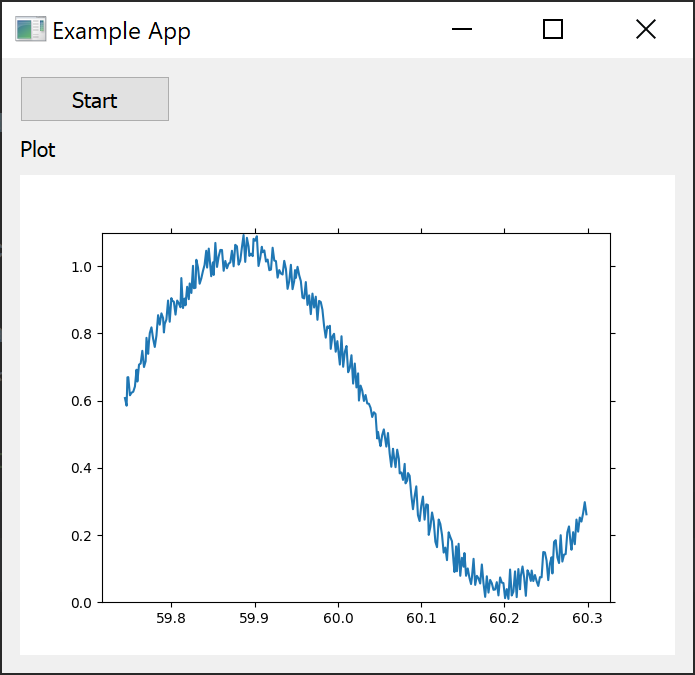

========
Examples
========

To view the examples, clone the public repository:

.. code-block:: console

    $ git clone git://github.com/acreegan/adv_prodcon

then navigate to the examples folder:

.. code-block:: console

    $ cd adv_prodcon/examples

Example Prodcon
---------------
The following is a quick example of how to use the adv_prodcon package. You can download it here: :download:`example_prodcon.py<../examples/example_prodcon.py>`.

.. code-block:: python

 import adv_prodcon
 import time
 from itertools import count

Imports.

.. code-block:: python

 class ExampleProducer(adv_prodcon.Producer):

     @staticmethod
     def on_start(state, message_pipe, *args, **kwargs):
         return {"count": count()}

     @staticmethod
     def work(on_start_result, state, message_pipe, *args):
         return next(on_start_result["count"])

Define a Producer class. Here we are using the on_start method to establish a itertools.count iterator. This is made available in the work function through the on_start_result argument. The work function will return the next count each time it is run.

.. code-block:: python

 class ExampleConsumer(adv_prodcon.Consumer):

     @staticmethod
     def work(items, on_start_result, state, message_pipe, *args):
         return f"Got :{items} from producer"

     def on_result_ready(self, result):
         print(result)

Define a Consumer Class. This Consumer will just be used as a buffer, returning a string with the items received from the Producer.
The on_result_ready function is called when the main process receives the result of the work function. Here we are just printing out the result.

.. code-block:: python

 if __name__ == "__main__":
     example_producer = ExampleProducer(work_timeout=1)
     example_consumer = ExampleConsumer(work_timeout=2,
                                        max_buffer_size=1000)

     example_producer.set_subscribers([example_consumer.get_work_queue()])
     example_producer.start_new()
     example_consumer.start_new()

     time.sleep(10)

In the main code block, we create an instance of both our ExampleProducer and our ExampleConsumer. We set the work_timeout of the ExampleProducer to 1 so that it runs once per second. We set the work_timeout of the ExampleConsumer to 2 so that every 2 seconds it performs work on all items in its queue. The max_buffer_size is set high so that the ExampleConsumer is controlled by its work_timeout.

The output of this code is shown below:

.. code-block:: console

 Got :[0, 1] from producer
 Got :[2, 3] from producer
 Got :[4, 5] from producer
 Got :[6, 7] from producer

 Process finished with exit code 0

Note that the output may be slightly different depending on the time taken to start the worker processes.

Example App
-----------
The following is an example app made using adv_prodcon and PyQt5. You can download the file here: :download:`example_app.py<../examples/example_app/example_app.py>`, :download:`example_app_layout.ui<../examples/example_app/example_app_layout.ui>`.
This app implements a Producer that generates a signal, and we plot it to the PyQt UI.

.. code-block:: python

    import random
    import PyQt5.QtCore
    from PyQt5 import QtWidgets, uic
    import adv_prodcon
    import matplotlib
    from matplotlib import animation
    from matplotlib.figure import Figure
    from matplotlib.backends.backend_qt5agg import (
        FigureCanvasQTAgg as FigureCanvas,
    )
    import time
    import math

Imports.

.. code-block:: python

    Ui_MainWindow, QMainWindow = uic.loadUiType("example_app_layout.ui")

Converting the example_app_layout.ui file to python objects.

.. code-block:: python

    class DataProducer(adv_prodcon.Producer):
        @staticmethod
        def work(on_start_result, state, message_pipe, *args):
            data = (math.sin(time.time()*10) + 1)/2 + random.random()/10
            timestamp = time.time()
            return {"data": data, "timestamp": timestamp}

Defining a Producer object. In this example, the work function simply outputs a sine wave with some noise added.

.. code-block:: python

    # Data consumer acts as a buffer so we can pass new data to our UI process at our leisure
    class DataConsumer(adv_prodcon.Consumer, PyQt5.QtCore.QObject):
        new_data = PyQt5.QtCore.pyqtSignal(list)

        def __init__(self, *args, **kwargs):
            PyQt5.QtCore.QObject.__init__(self)
            adv_prodcon.Consumer.__init__(self, *args, **kwargs)

        @staticmethod
        def work(items, on_start_result, state, message_pipe, *args):
            return items

        def on_result_ready(self, result):
            self.new_data.emit(result)

Defining a Consumer object. In this example the consumer is simply used as a buffer to control the rate at which the UI updates.
We hook this into PyQt5 by having it extend the QObject and implement a pyqtSignal. In on_result_ready, we call the PyQt function emit on the result. We can then connect to this signal.

.. code-block:: python

    plot_config = {
        "num_points": 300
    }

    class MainWindow(QMainWindow, Ui_MainWindow):
        def __init__(self):
            super(MainWindow, self).__init__()
            self.setupUi(self)

            self.plot_axes = None
            self.ani = None
            self.plot_data = {"data": [], "times": []}
            self.add_plot()

            self.producer = DataProducer(work_timeout=0.00001)
            self.consumer = DataConsumer(work_timeout=0.01, max_buffer_size=1000, lossy_queue=True)
            self.producer.set_subscribers([self.consumer.get_work_queue()])

            self.startButton.clicked.connect(self.start)
            self.stopButton.clicked.connect(self.stop)

            self.consumer.new_data.connect(lambda result: self.update_plot_data(result))

            self.start_time = time.time()

Defining the __init__ for the MainWindow object. We set the DataProducer to run at 100khz, and the DataConsumer to run at 100hz. This means that every 10ms the display will update with all the data generated since the last update.

We set the lossy_queue parameter to True, indicating that we care more about displaying the latest data than ensuring we display all the data. This is likely not necessary here, but could be useful if we were doing some more processing on the data.

We use Qt's signal and slot system to connect the consumer's new_data signal to the main_window's update_plot_data method.

.. code-block:: python

        def start(self):
            self.startButton.setVisible(False)
            self.stopButton.setVisible(True)

            self.clear_plot()

            self.producer.start_new()
            self.consumer.start_new()
            self.ani = animation.FuncAnimation(self.plot_axes.figure, update_plot,
                                               fargs=(self.plot_data, self.plot_axes), interval=50)
            self.plot_axes.figure.canvas.draw()

        def stop(self):
            self.startButton.setVisible(True)
            self.stopButton.setVisible(False)

            self.producer.set_stopped()
            self.consumer.set_stopped()
            self.ani.pause()
            self.ani = None

Here we are implementing the functionality of the start and stop buttons. When the start button is clicked, we call the start_new function on both the producer and consumer. We also start out plot animation. When the stop button is clicked, we call set_stopped on our producer and consumer.

.. code-block:: python

        def add_plot(self):
            self.placeholderWidget.setParent(None)
            self.placeholderWidget.deleteLater()

            canvas = FigureCanvas(matplotlib.figure.Figure())
            self.plot_axes = canvas.figure.subplots()

            self.verticalLayout.addWidget(canvas)

        def clear_plot(self):
            for line in self.plot_axes.lines:
                line.remove()
            self.plot_data = {"data": [], "times": []}
            self.plot_axes.figure.canvas.draw()

        def update_plot_data(self, items):
            new_data = [item["data"] for item in items]
            new_times = [item["timestamp"]-self.start_time for item in items]

            data = self.plot_data["data"]
            times = self.plot_data["times"]

            for d in new_data:
                data.append(d)

            for t in new_times:
                times.append(t)

            self.plot_data["data"] = data[-1 * plot_config["num_points"]:]
            self.plot_data["times"] = times[-1 * plot_config["num_points"]:]

Defining the plot functions for the app. Add plot is called in __init__ and adds a plot to the layout. clear_plot is called when the start button is clicked, and clears the old data from the plot. update_plot_data is connected to our consumer's new_data signal, so it is called whenever the consumer's work function finishes. update_plot_data appends the new data to our Main Window's data list, and moves the window over.

.. code-block:: python

    def update_plot(i, data, axes):
        axes.clear()
        line = axes.plot(data["times"], data["data"])
        axes.set_ylim(0, 1.1)
        return line

The update plot function is a static function called by the FuncAnimation. It updates the Matplotlib axes with new data. This is called periodically by the Matplotlib FuncAnimation.

.. code-block:: python

    if __name__ == '__main__':
        app = QtWidgets.QApplication([])
        main_window = MainWindow()
        main_window.setWindowTitle("Example App")
        main_window.show()
        app.exec()

Main block. This is mostly to instantiate our main_window and run our app.
